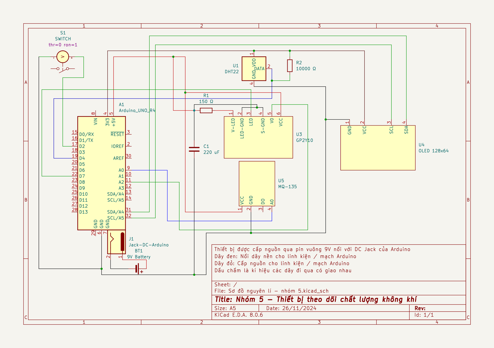

## Thiết bị theo dõi chất lượng không khí

Repo này là của dự án nhập môn Điện tử Viễn thông kì học 2024.1 của nhóm 5, ET1-02-K69. Mình là nhóm trường và cũng là người nghĩ ra ý tưởng và thực hiện chính cho dự án này. CHủ đề của dự án là thiết bị tính chỉ số AQI bụi mịn PM2.5 và nhiệt độ, độ ẩm, nồng độ CO2 (sản phẩm chỉ mang tính chất proof-of-concept, tất nhiên là các cảm biến này hơi yếu để đạt độ chính xác cao). Sản phẩm có giao diện cơ bản qua Blynk IOT. Nhóm mình được điểm A môn này.

Schematic (Arduino R4): 

Hình ảnh sản phẩm :

U: unconnected - trạng thái ko dùng mạng

C: connected - trạng thái dùng mạng

